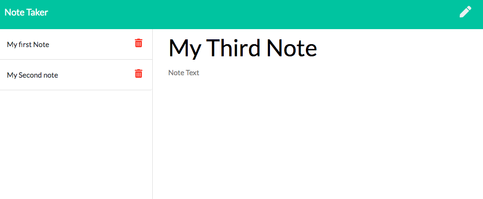

# Note-Taker

Note-Taker is an application that can be used to create, save, edit, and delete notes throughout the day. 

## Prerequisites
* NodeJS

## Usage
* clone the repository:

```
git clone https://github.com/Sydneypo/note-taker.git
```

run `npm install` to install all dependencies. Enter `http://localhost:3000` in your browser. The Note-Taker app is deployed to [Heroku](https://agile-sands-35744.herokuapp.com/).

## Preview



## Authors

Sydney Porter
* [github](https://github.com/Sydneypo/note-taker.git)

